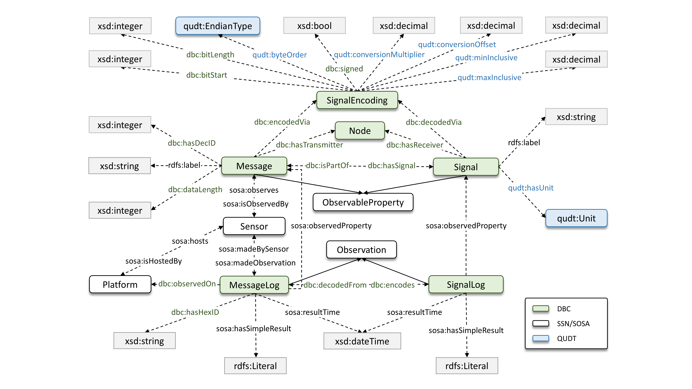

# CANDI - A Semantic Framework for CAN bus Data Modeling and System Integration


CANDI is a semantic framework for dynamic CAN bus data decoding, system integration, and E2E deployment automation. CANDI combines virtual knowledge graphs (VKG) with OBDA principles to bridge raw data streams with structured semantic representations, enabling runtime message decoding, semantically governed diagnostics, and real-time analytics.

## DBC Ontology:


<p align="center"><em>DBC Ontology: The core concepts and semantic relationships</em></p>


The DBC Ontology is a domain ontology for modeling Controller Area Network (CAN) communication systems in a semantic and machine-interpretable way. It captures the structure and meaning of CAN messages, signals, electronic control units (ECUs), encoding schemas, and data logging processes, providing a unified conceptual layer for low-level communication data that is otherwise difficult to integrate and analyze. The ontology is designed as an extension of the W3C SSN/SOSA standards and aligns with QUDT to ensure interoperability and consistent representation of physical quantities and units. 

The motivation for the DBC Ontology arises from the growing volume and importance of CAN bus data in transportation and cyber-physical systems, including automotive, maritime, railway, and aerospace domains. While CAN is widely adopted as a reliable communication protocol, its data is typically stored and exchanged in encoded, schema-dependent formats (e.g., DBC files) that lack explicit semantics and hinder cross-system integration, reuse, and advanced analytics. Existing semantic models often operate at higher abstraction levels or assume pre-decoded data, limiting their applicability to real-time, resource-constrained, or security-sensitive environments. Against this state of the art, the DBC Ontology aims to bridge the gap between raw CAN bus data and semantic data integration frameworks. 

Its goals are to 
(i) provide a standardized semantic representation of CAN communication grounded in established W3C ontologies, 
(ii) support dynamic decoding and ontology-based access to encoded data streams, 
(iii) enable scalable, secure, and reusable analytics across domains. 

By serving as the semantic core of the CANDI framework (see here: https://github.com/paitools/DBCOntology and https://zenodo.org/records/17671851), the DBC Ontology facilitates automated deployment, real-time diagnostics, and long-term analysis of CAN-based telemetry, while remaining open, extensible, and reusable for the broader community.

## Ontology Documentation:

Ontology Specification with permanent (https://w3id.org/dbc-ontology/) identifier:

[](https://paitools.github.io/DBCOntology/documentation/index-en.html)

## CANDI User Guide

Running **CANDI** on user hardware involves two automated steps:

1. **Create the Knowledge Graph Matrix (KGM)**
2. **Deploy the Framework**


### 1. KGM Creation

1. Set the `DBC_FILE` path in the `load_dbc.py` configuration (e.g., `DBC/boening.dbc`).
   
2. Run the script:
   ```bash
   python3 load_dbc.py
   
- The script will also load unit_mapping.json to convert user-defined DBC units into QUDT standard units (e.g., `kW` → `KiloW`).
  * If a unit is not found in the mapping file, the original value is preserved and a warning is issued.

- **Output:** a file named  `KGM.xlsx` will be generated in the project’s root directory.

### 2. CANDI Deployment

- After verifying the KGM, set the `raw_data_path` to your CAN bus logging structure (e.g., `raw/*/*/*/*.csv`).
  
- Deploy the framework:
  ```bash
  python3 CANDI.py

### Running SPARQL

- To run SPARQL queries (e.g., `user_query.rq`) on real-time data:

   ```bash
   ontop.bat query -p ontop.properties -m mapping.ttl -q user_query.rq

Requirements

- DuckDB ≥ `1.0.0`
- Ontop client ≥ `5.3.0`

Ensure both are installed before running the framework. 
If compatibility issues occur, use the exact versions listed above.


## License

All resources are licensed under the [Creative Commons Attribution-NonCommercial-ShareAlike 4.0 International](https://creativecommons.org/licenses/by-nc-sa/4.0/) license.


